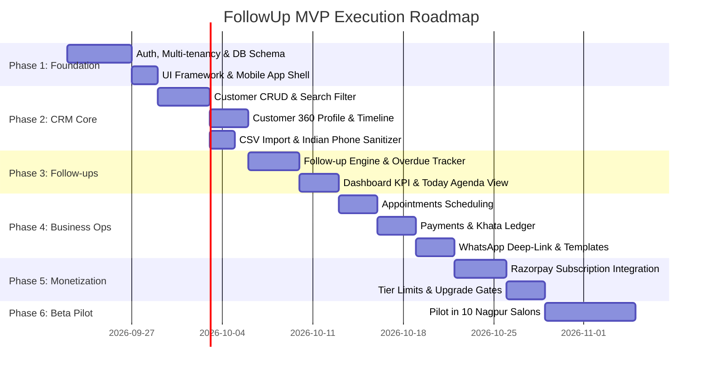

# Product Requirements & Technical Architecture Document (PRD + TRD)
## FollowUp — WhatsApp Mini-CRM for Local Service Businesses
**Document Version:** 1.0.0 (MVP Release Specification)  
**Target Market:** Indian Local Service Businesses (Salons, Clinics, Repair Shops, Tailors, Tutors)  
**Primary Currency:** INR (₹)  
**Author / Role:** Full-Stack Lead Engineer & Product Architect  
**Status:** Approved for Implementation  

---

## 1. Executive Summary & Vision

### 1.1 The Core Problem
Over 60 million micro and small service businesses in India run their daily operations through an informal, fragile combination of WhatsApp personal chats, paper diaries, phone contacts, Excel sheets, and memory.
* **Leads & Follow-ups slip through the cracks:** A salon owner gets 20 WhatsApp inquiries a day, promises to call back on Wednesday, and completely forgets.
* **Pending Khata (Uncollected Dues):** Customers receive service with "pay online later", leading to ₹15,000–₹50,000 in untracked, uncollected receivables per shop.
* **Context Loss:** Owners and staff have no unified timeline of past customer visits, preferred services, or notes.
* **Enterprise CRMs Fail:** Salesforce, HubSpot, or Zoho are too expensive, English-centric, desktop-oriented, and overly complex for a 2-to-5-person local business.

### 1.2 Product Vision: "WhatsApp + Digital Notebook"
**FollowUp** is an ultra-lean, mobile-first web CRM designed specifically for Indian service SMBs. It transforms unstructured WhatsApp chats into an organized system of customer records, timely follow-up reminders, scheduled appointments, and pending payment trackers with zero enterprise bloat.

### 1.3 Guiding Product Principles
1. **Zero-API WhatsApp Simplicity:** Do not force small businesses to buy expensive Meta WhatsApp Business Cloud APIs or verify Facebook Business Managers for MVP. Use zero-friction `wa.me` deep links with pre-compiled dynamic templates.
2. **Mobile-First Touch Ergonomics:** 95% of users will use this on low-to-mid-range Android smartphones while standing in a busy shop. Every critical action must be reachable within 1 tap of the thumb.
3. **Sub-3-Minute Time-to-Value:** From landing on the site to importing contacts and sending the first follow-up reminder must take under 3 minutes.
4. **Ruthless Scope Discipline:** No inventory, no payroll, no complex accounting. If a feature does not directly help "remember and follow up with a customer", it is strictly out of scope for v1.

---

## 2. Personas & Workflows

### 2.1 Personas
* **Primary Persona: Rahul (Shop Owner / Operator)**
  * *Age:* 32 | *Business:* Rahul Men's Grooming Salon, Nagpur | *Staff:* 3 barbers
  * *Daily Context:* Busy on the floor cutting hair; handles appointments via WhatsApp while answering phone calls.
  * *Core Frustration:* *"I lose ₹5,000 every week because people say 'bhaiya kal aayenge' and I forget to message them. By evening my WhatsApp chat list is buried under 150 personal messages."*
* **Secondary Persona: Amit (Senior Stylist / Staff Member)**
  * *Context:* Needs to know who is coming today, what service they want, and note if they still owe ₹300.
  * *Access:* Limited to viewing today's appointments, adding notes, marking follow-ups done, and recording payments.

### 2.2 End-to-End User Journey
```
[Customer chats on WhatsApp] 
         ↓
[Owner opens FollowUp mobile web / PWA]
         ↓
[Quick Add: Name + 10-digit Phone + Note: "Wants hair spa on Friday"]
         ↓
[Create Follow-up for Friday 10:00 AM]
         ↓
[Friday 09:30 AM: System Alert on Dashboard]
         ↓
[Tap "Open WhatsApp" → Auto-launches WhatsApp with pre-filled personalized message]
         ↓
[Customer confirms → Tap "Mark Booked" → Create Appointment]
         ↓
[Customer visits → Tap "Record Payment" (Paid ₹800, Pending ₹200)]
         ↓
[System queues automated Follow-up for pending ₹200 in 3 days]
```

---

## 3. Product Features & Detailed Specifications

### 3.1 Authentication & Multi-Tenant Onboarding
* **Auth Modes:** Email + Password with secure session cookies (NextAuth / Auth.js / Supabase Auth).
* **Multi-Tenancy:** Strict tenant boundary (`organization_id`). A business is created upon signup. All queries are scoped to the authenticated tenant.
* **Onboarding Wizard (< 3 minutes):**
  1. *Business Details:* Business Name, Category (Salon, Clinic, Tailor, Repair, Tutor, Other), City, Currency (Default ₹ INR).
  2. *Quick Contact Import:* [Upload CSV] or [Quick Add First 3 Customers] or [Skip].
  3. *Immediate First Action:* Prompt to set up their very first follow-up reminder.

### 3.2 Command Center Dashboard
* **Real-time KPI Ribbon:**
  * `Total Customers`: Count of active profiles.
  * `Due Follow-ups`: Badge highlighting overdue + today's pending follow-ups.
  * `Today's Appointments`: Total scheduled for current date.
  * `Pending Khata (₹)`: Total uncollected receivables across all customers.
* **Today's Action Feed:**
  * Chronological cards of actions due today.
  * Each card has: Customer Name, Phone, Time, Priority Badge (High/Medium/Low), Context note, and one-tap `[WhatsApp]` and `[Done]` buttons.
* **Recent Activity Feed:** Latest 10 customer interactions (notes, payments received, appointments booked).

### 3.3 Customer Management (360° Profile)
* **Customer List View:**
  * Search by Name, 10-digit Phone, or Note keywords.
  * Quick filter pills: `All`, `Follow-up Due`, `Pending Payment`, `Active`, `VIP`.
  * CSV Bulk Import (Name, Phone, Email, Initial Notes, Outstanding Balance) with client-side validation for Indian phone formats.
  * CSV Export for merchant data portability.
* **Customer Profile Screen (Core Workspace):**
  * Header: Customer Name, Normalized Phone, Status Pill (`New`, `Contacted`, `Booked`, `Active`, `Completed`, `Follow-up`, `Lost`), Lifetime Revenue, Current Pending Dues.
  * Quick Action Floating Bar:
    * `[WhatsApp]`: Opens modal to select template and launch chat.
    * `[Call]`: Triggers `tel:+91XXXXXXXXXX`.
    * `[+ Follow-up]`: Opens quick follow-up drawer.
    * `[+ Appointment]`: Schedules service date & time.
    * `[+ Payment]`: Logs amount received and updates pending balance.
    * `[+ Note]`: Adds quick text note with timestamp.
  * Unified Activity Timeline: Reverse-chronological feed showing appointments, payments, follow-ups, and notes.

### 3.4 Follow-Up Management (The Core Retention Engine)
* **Creation Fields:**
  * Customer ID (linked)
  * Title / Purpose (e.g., "Confirm weekend appointment", "Follow up on bridal inquiry", "Collect balance ₹500")
  * Due Date & Time
  * Priority: `URGENT`, `HIGH`, `MEDIUM`, `LOW`
  * Reminder Lead Time: 15 min, 30 min, 1 hour, 1 day prior
* **Lifecycle:** `PENDING` → `COMPLETED` | `CANCELLED` | `RESCHEDULED`
* **Overdue System:** Follow-ups past their scheduled time display an amber/red overdue badge and float to the top of the dashboard feed.

### 3.5 Appointments & Service Scheduling
* **Fields:** Customer, Service Name (e.g., "Haircut + Beard Styling"), Scheduled Date, Scheduled Time, Duration (minutes), Assigned Staff Member, Price, Status (`SCHEDULED`, `CONFIRMED`, `COMPLETED`, `CANCELLED`, `NO_SHOW`).
* **Views:**
  * Agenda List View (Default for mobile).
  * Day / Week Calendar view (Tablet / Desktop).

### 3.6 Payment & Khata Ledger (Receivables Tracker)
* **Transaction Fields:**
  * Customer, Bill/Invoice Reference (optional), Total Amount (₹), Paid Amount (₹), Balance Pending (₹ = Total - Paid).
  * Payment Mode: `UPI (GPay/PhonePe/Paytm)`, `Cash`, `Card`, `NetBanking`.
  * Status: `PAID`, `PARTIALLY_PAID`, `PENDING`, `REFUNDED`.
* **Khata Summary:** Calculates merchant-wide and customer-specific outstanding credit.
* **One-Tap Payment Reminder:** Pre-drafted WhatsApp template including the customer's exact pending amount and shop's UPI ID / phone number.

### 3.7 WhatsApp Deep-Link & Template Engine
* **Deep-Link Protocol:**
  * Standard URL format: `https://wa.me/91<PHONE_NUMBER>?text=<URL_ENCODED_MESSAGE>`
  * Web fallback for desktop browsers: `https://web.whatsapp.com/send?phone=91<PHONE_NUMBER>&text=<URL_ENCODED_MESSAGE>`
* **Indian Phone Number Sanitization Engine:**
  * Strips spaces, dashes, parentheses, leading zeros, and existing `+91` or `91` prefixes.
  * Validates standard Indian 10-digit mobile range: `/^[6-9]\d{9}$/`.
* **Dynamic Template Interpolation:**
  * Supports variables: `{{customer_name}}`, `{{business_name}}`, `{{appointment_date}}`, `{{appointment_time}}`, `{{service_name}}`, `{{amount}}`, `{{pending_amount}}`, `{{owner_phone}}`.
* **Out-of-the-Box Indian Service Templates:**
  1. *Appointment Reminder:* "Hi {{customer_name}}, this is a friendly reminder from {{business_name}} regarding your appointment for {{service_name}} on {{appointment_date}} at {{appointment_time}}. See you soon!"
  2. *Follow-Up / Re-engagement:* "Hello {{customer_name}}! It has been a while since your last visit to {{business_name}}. Would you like to schedule a slot this week? Reply here to book!"
  3. *Payment Khata Reminder:* "Dear {{customer_name}}, gentle reminder from {{business_name}}: pending balance of ₹{{pending_amount}} is due. You can pay via UPI to {{owner_phone}}. Thank you!"
  4. *Post-Service Thank You:* "Hi {{customer_name}}, thank you for visiting {{business_name}} today! Let us know if you need anything else. Have a great day!"

### 3.8 Subscription & Monetization (Razorpay)
* **Tier Structure:**
  * **Free:** ₹0/mo — Up to 50 customers, basic follow-ups, standard dashboard.
  * **Starter:** ₹299/mo — Up to 500 customers, unlimited follow-ups, appointments, payments, WhatsApp templates, CSV import/export.
  * **Business:** ₹699/mo — Unlimited customers, up to 5 staff members, analytics, custom templates, priority WhatsApp support.
  * **Pro:** ₹1,499/mo — Multi-branch support, unlimited staff, full export & webhook access.
* **Billing Gateway:** Razorpay Subscriptions (Recurring UPI Autopay, Debit/Credit Card, Netbanking).
* **Grace Period & Degradation:** 3-day payment grace period before tenant enters read-only mode for excess records.

---

## 4. Technical Architecture

### 4.1 System Overview
```
┌─────────────────────────────────────────────────────────────┐
│                 Client (Mobile Web PWA / Browser)            │
│               Next.js 16 App Router (React 19)              │
│               Tailwind CSS v4 + Lucide Icons                │
└──────────────────────────────┬──────────────────────────────┘
                               │ HTTPS / Server Actions & API
                               ▼
┌─────────────────────────────────────────────────────────────┐
│                  Next.js Edge / Node Server                 │
│  ┌─────────────────────────┐   ┌─────────────────────────┐  │
│  │    Tenant Auth Middleware│   │    Input Validation     │  │
│  │    (Session + Org ID)   │   │     (Zod Schemas)       │  │
│  └────────────┬────────────┘   └────────────┬────────────┘  │
└───────────────┼─────────────────────────────┼───────────────┘
                │                             │
                ▼                             ▼
┌─────────────────────────────────────────────────────────────┐
│                   Data & Service Layer                      │
│   Prisma ORM (Connection Pool)                              │
│   PostgreSQL (Multi-tenant schema with organization_id)     │
│   Redis (Upstash for Rate Limiting & Background Jobs)       │
└─────────────────────────────────────────────────────────────┘
```

### 4.2 Database Schema (Prisma)

```prisma
datasource db {
  provider = "postgresql"
  url      = env("DATABASE_URL")
}

generator client {
  provider = "prisma-client-js"
}

enum Role {
  OWNER
  ADMIN
  STAFF
}

enum CustomerStatus {
  NEW
  CONTACTED
  INTERESTED
  BOOKED
  ACTIVE
  COMPLETED
  FOLLOW_UP
  LOST
}

enum Priority {
  LOW
  MEDIUM
  HIGH
  URGENT
}

enum FollowupStatus {
  PENDING
  COMPLETED
  CANCELLED
  RESCHEDULED
}

enum AppointmentStatus {
  SCHEDULED
  CONFIRMED
  COMPLETED
  CANCELLED
  NO_SHOW
}

enum PaymentStatus {
  PENDING
  PARTIALLY_PAID
  PAID
  REFUNDED
}

enum PaymentMethod {
  CASH
  UPI
  CARD
  NETBANKING
  OTHER
}

enum SubscriptionTier {
  FREE
  STARTER
  BUSINESS
  PRO
}

enum SubscriptionStatus {
  TRIAL
  ACTIVE
  PAST_DUE
  CANCELLED
  EXPIRED
}

model Organization {
  id              String             @id @default(cuid())
  name            String
  slug            String             @unique
  category        String             // Salon, Clinic, Tailor, etc.
  phone           String
  city            String?
  logoUrl         String?
  createdAt       DateTime           @default(now())
  updatedAt       DateTime           @updatedAt

  members         OrganizationMember[]
  customers       Customer[]
  followups       Followup[]
  appointments    Appointment[]
  payments        Payment[]
  templates       MessageTemplate[]
  subscription    Subscription?

  @@index([slug])
}

model User {
  id            String               @id @default(cuid())
  name          String
  email         String               @unique
  passwordHash  String
  phone         String?
  createdAt     DateTime             @default(now())
  updatedAt     DateTime             @updatedAt

  memberships   OrganizationMember[]
  assignedFollowups   Followup[]     @relation("AssignedFollowups")
  assignedAppointments Appointment[] @relation("AssignedAppointments")
}

model OrganizationMember {
  id              String       @id @default(cuid())
  organizationId  String
  userId          String
  role            Role         @default(STAFF)
  createdAt       DateTime     @default(now())

  organization    Organization @relation(fields: [organizationId], references: [id], onDelete: Cascade)
  user            User         @relation(fields: [userId], references: [id], onDelete: Cascade)

  @@unique([organizationId, userId])
  @@index([organizationId])
}

model Customer {
  id              String         @id @default(cuid())
  organizationId  String
  name            String
  phone           String         // Stored as 10 digits without prefix e.g. 9876543210
  email           String?
  status          CustomerStatus @default(NEW)
  notes           String?
  tags            String[]       @default([])
  totalSpent      Decimal        @default(0.0) @db.Decimal(10, 2)
  pendingBalance  Decimal        @default(0.0) @db.Decimal(10, 2)
  createdAt       DateTime       @default(now())
  updatedAt       DateTime       @updatedAt

  organization    Organization   @relation(fields: [organizationId], references: [id], onDelete: Cascade)
  followups       Followup[]
  appointments    Appointment[]
  payments        Payment[]
  timeline        ActivityLog[]

  @@unique([organizationId, phone])
  @@index([organizationId, status])
  @@index([organizationId, name])
  @@index([organizationId, phone])
}

model Followup {
  id              String         @id @default(cuid())
  organizationId  String
  customerId      String
  assignedToId    String?
  title           String
  notes           String?
  dueDate         DateTime
  priority        Priority       @default(MEDIUM)
  status          FollowupStatus @default(PENDING)
  completedAt     DateTime?
  createdAt       DateTime       @default(now())
  updatedAt       DateTime       @updatedAt

  organization    Organization   @relation(fields: [organizationId], references: [id], onDelete: Cascade)
  customer        Customer       @relation(fields: [customerId], references: [id], onDelete: Cascade)
  assignedTo      User?          @relation("AssignedFollowups", fields: [assignedToId], references: [id], onDelete: SetNull)

  @@index([organizationId, status, dueDate])
  @@index([customerId])
}

model Appointment {
  id              String            @id @default(cuid())
  organizationId  String
  customerId      String
  assignedToId    String?
  serviceName     String
  startTime       DateTime
  endTime         DateTime?
  price           Decimal           @default(0.0) @db.Decimal(10, 2)
  status          AppointmentStatus @default(SCHEDULED)
  notes           String?
  createdAt       DateTime          @default(now())
  updatedAt       DateTime          @updatedAt

  organization    Organization      @relation(fields: [organizationId], references: [id], onDelete: Cascade)
  customer        Customer          @relation(fields: [customerId], references: [id], onDelete: Cascade)
  assignedTo      User?             @relation("AssignedAppointments", fields: [assignedToId], references: [id], onDelete: SetNull)

  @@index([organizationId, startTime])
  @@index([customerId])
}

model Payment {
  id              String        @id @default(cuid())
  organizationId  String
  customerId      String
  invoiceNumber   String?
  totalAmount     Decimal       @db.Decimal(10, 2)
  paidAmount      Decimal       @db.Decimal(10, 2)
  pendingAmount   Decimal       @db.Decimal(10, 2)
  status          PaymentStatus @default(PAID)
  paymentMethod   PaymentMethod @default(UPI)
  notes           String?
  paidAt          DateTime      @default(now())
  createdAt       DateTime      @default(now())

  organization    Organization  @relation(fields: [organizationId], references: [id], onDelete: Cascade)
  customer        Customer      @relation(fields: [customerId], references: [id], onDelete: Cascade)

  @@index([organizationId, paidAt])
  @@index([customerId])
}

model MessageTemplate {
  id              String       @id @default(cuid())
  organizationId  String
  title           String       // e.g. "Appointment Reminder"
  category        String       // REMINDER, KHATA, FOLLOWUP, PROMO
  body            String       // e.g. "Hi {{customer_name}}, your appointment at {{business_name}}..."
  isDefault       Boolean      @default(false)
  createdAt       DateTime     @default(now())
  updatedAt       DateTime     @updatedAt

  organization    Organization @relation(fields: [organizationId], references: [id], onDelete: Cascade)

  @@index([organizationId, category])
}

model ActivityLog {
  id              String       @id @default(cuid())
  organizationId  String
  customerId      String
  actionType      String       // CREATED, FOLLOWUP_SET, PAYMENT_RECEIVED, NOTE_ADDED, WHATSAPP_SENT
  description     String
  metadata        Json?
  createdAt       DateTime     @default(now())

  customer        Customer     @relation(fields: [customerId], references: [id], onDelete: Cascade)

  @@index([customerId, createdAt])
}

model Subscription {
  id                   String             @id @default(cuid())
  organizationId       String             @unique
  tier                 SubscriptionTier   @default(FREE)
  status               SubscriptionStatus @default(TRIAL)
  razorpayCustomerId   String?
  razorpaySubId        String?
  currentPeriodStart   DateTime           @default(now())
  currentPeriodEnd     DateTime
  cancelAtPeriodEnd    Boolean            @default(false)
  createdAt            DateTime           @default(now())
  updatedAt            DateTime           @updatedAt

  organization         Organization       @relation(fields: [organizationId], references: [id], onDelete: Cascade)
}
```

---

## 5. Security & Multi-Tenancy Architecture

### 5.1 Absolute Tenant Isolation
Every query accessing database models **MUST** enforce the `organizationId` predicate matching the authenticated session.
```typescript
// Tenant Safe Query Utility Example
export async function getTenantCustomer(orgId: string, customerId: string) {
  return await prisma.customer.findFirst({
    where: {
      id: customerId,
      organizationId: orgId, // CRITICAL: NEVER omit organizationId
    },
    include: {
      followups: { orderBy: { dueDate: 'asc' } },
      appointments: { orderBy: { startTime: 'desc' }, take: 10 },
      payments: { orderBy: { paidAt: 'desc' }, take: 10 },
    }
  });
}
```

### 5.2 Role-Based Access Matrix (RBAC)
| Resource / Action | OWNER | ADMIN | STAFF |
|---|:---:|:---:|:---:|
| View Customers & History | Yes | Yes | Yes |
| Create / Edit Customers | Yes | Yes | Yes |
| Delete / Archive Customer | Yes | Yes | No |
| Create / Complete Follow-up | Yes | Yes | Yes |
| Manage Appointments | Yes | Yes | Yes |
| Log Payments & Khata | Yes | Yes | Yes |
| View Financial Aggregates / Revenue | Yes | Yes | No (Only counts) |
| Invite / Manage Staff | Yes | Yes | No |
| Change Subscription / Billing | Yes | No | No |

---

## 6. Utilities & WhatsApp Integration Engine

### 6.1 Indian Phone Number Normalization (`lib/phone.ts`)
```typescript
/**
 * Normalizes Indian mobile phone numbers into clean 10 digits
 * Accepts: "+91 98765 43210", "09876543210", "98765-43210", "919876543210"
 * Returns: "9876543210" or null if invalid
 */
export function normalizeIndianPhone(input: string): string | null {
  if (!input) return null;
  const digits = input.replace(/\D/g, '');
  
  if (digits.length === 10 && /^[6-9]\d{9}$/.test(digits)) {
    return digits;
  }
  if (digits.length === 11 && digits.startsWith('0')) {
    const sliced = digits.slice(1);
    if (/^[6-9]\d{9}$/.test(sliced)) return sliced;
  }
  if (digits.length === 12 && digits.startsWith('91')) {
    const sliced = digits.slice(2);
    if (/^[6-9]\d{9}$/.test(sliced)) return sliced;
  }
  return null;
}

export function formatIndianPhoneDisplay(tenDigits: string): string {
  if (tenDigits.length !== 10) return tenDigits;
  return `+91 ${tenDigits.slice(0, 5)} ${tenDigits.slice(5)}`;
}
```

### 6.2 WhatsApp Deep Link Generator (`lib/whatsapp.ts`)
```typescript
import { normalizeIndianPhone } from './phone';

interface TemplateParams {
  customer_name?: string;
  business_name?: string;
  appointment_date?: string;
  appointment_time?: string;
  service_name?: string;
  amount?: string;
  pending_amount?: string;
  owner_phone?: string;
}

export function compileTemplate(templateBody: string, params: TemplateParams): string {
  return templateBody.replace(/{{\s*(\w+)\s*}}/g, (_, key: keyof TemplateParams) => {
    return params[key] ?? '';
  });
}

export function generateWhatsAppLink(phone: string, message: string): string {
  const cleanPhone = normalizeIndianPhone(phone);
  if (!cleanPhone) throw new Error('Invalid Indian phone number');
  const encodedMessage = encodeURIComponent(message.trim());
  return `https://wa.me/91${cleanPhone}?text=${encodedMessage}`;
}
```

---

## 7. API Surface & Contract Specifications

### 7.1 Customer Endpoints
* **`GET /api/customers`**
  * *Query Params:* `search`, `status`, `page`, `limit`
  * *Response 200:* `{ customers: Customer[], totalCount: number, page: number }`
* **`POST /api/customers`**
  * *Body (Zod):* `{ name: string, phone: string, email?: string, notes?: string, status?: CustomerStatus }`
  * *Response 201:* `{ customer: Customer }`
* **`GET /api/customers/:id`**
  * *Response 200:* `{ customer: CustomerWithRelations }`
* **`PATCH /api/customers/:id`**
  * *Body:* Partial customer update.
* **`POST /api/customers/import`**
  * *Body:* `{ customers: Array<{ name: string, phone: string, notes?: string, pendingBalance?: number }> }`
  * *Response 200:* `{ inserted: number, skipped: number, errors: string[] }`

### 7.2 Follow-Up Endpoints
* **`GET /api/followups`**
  * *Query Params:* `status` (`PENDING` | `COMPLETED`), `due` (`today` | `overdue` | `upcoming`)
  * *Response 200:* `{ followups: FollowupWithCustomer[] }`
* **`POST /api/followups`**
  * *Body (Zod):* `{ customerId: string, title: string, dueDate: ISOString, priority?: Priority, notes?: string }`
  * *Response 201:* `{ followup: Followup }`
* **`PATCH /api/followups/:id`**
  * *Body:* `{ status: FollowupStatus, completedAt?: ISOString, notes?: string }`

### 7.3 Appointment Endpoints
* **`GET /api/appointments`**
  * *Query Params:* `start`, `end`, `staffId`
* **`POST /api/appointments`**
  * *Body:* `{ customerId: string, serviceName: string, startTime: ISOString, price?: number, assignedToId?: string }`

### 7.4 Payment & Khata Endpoints
* **`POST /api/payments`**
  * *Body:* `{ customerId: string, totalAmount: number, paidAmount: number, paymentMethod: PaymentMethod, notes?: string }`
  * *Side Effect:* Updates `customer.pendingBalance` and `customer.totalSpent`, inserts `ActivityLog`.

### 7.5 Dashboard KPI Endpoint
* **`GET /api/dashboard/stats`**
  * *Response 200:*
    ```json
    {
      "totalCustomers": 428,
      "dueFollowups": 12,
      "overdueFollowups": 3,
      "todayAppointments": 8,
      "pendingReceivables": 14500,
      "revenueThisMonth": 84500
    }
    ```

---

## 8. Directory & Codebase Layout

```
follow-up/
├── AGENTS.md                  # Next.js 16 agent rules
├── package.json
├── prisma/
│   └── schema.prisma          # Multi-tenant data model
├── public/
│   └── icons/                 # PWA icons & branding
├── src/
│   ├── app/
│   │   ├── (auth)/
│   │   │   ├── login/page.tsx
│   │   │   ├── signup/page.tsx
│   │   │   └── onboarding/page.tsx
│   │   ├── (dashboard)/
│   │   │   ├── layout.tsx     # App shell with bottom nav & sidebar
│   │   │   ├── page.tsx       # Main dashboard (KPIs + Today's Agenda)
│   │   │   ├── customers/
│   │   │   │   ├── page.tsx   # Customer list + Search + CSV Import
│   │   │   │   └── [id]/page.tsx # Customer 360 profile + timeline
│   │   │   ├── followups/page.tsx # Follow-up queue & status filter
│   │   │   ├── appointments/page.tsx # Calendar / Daily agenda
│   │   │   ├── payments/page.tsx  # Khata & pending dues ledger
│   │   │   ├── templates/page.tsx # WhatsApp template management
│   │   │   └── settings/
│   │   │       ├── profile/page.tsx
│   │   │       ├── billing/page.tsx # Razorpay subscription view
│   │   │       └── team/page.tsx
│   │   ├── api/
│   │   │   ├── auth/[...nextauth]/route.ts
│   │   │   ├── customers/route.ts
│   │   │   ├── followups/route.ts
│   │   │   ├── appointments/route.ts
│   │   │   ├── payments/route.ts
│   │   │   ├── webhooks/razorpay/route.ts
│   │   │   └── dashboard/stats/route.ts
│   │   ├── layout.tsx
│   │   └── globals.css
│   ├── components/
│   │   ├── ui/                # Base primitives (Button, Dialog, Badge, Input)
│   │   ├── dashboard/         # KPI Cards, TodayAgenda, QuickActions
│   │   ├── customers/         # CustomerTable, CustomerDrawer, ImportModal
│   │   ├── followups/         # FollowupCard, CreateFollowupModal
│   │   ├── whatsapp/          # WhatsAppModal, TemplatePicker
│   │   └── layout/            # BottomNav (Mobile), Sidebar (Desktop)
│   ├── lib/
│   │   ├── prisma.ts          # Singleton Prisma client
│   │   ├── auth.ts            # Auth session helpers
│   │   ├── phone.ts           # Indian phone normalizer
│   │   ├── whatsapp.ts        # WhatsApp deep link & template compiler
│   │   └── razorpay.ts        # Payment gateway wrapper
│   └── types/
│       └── index.ts           # Shared TypeScript interfaces
```

---

## 9. Implementation Milestones & 6-Week Execution Plan



### Detailed Week-by-Week Deliverables:
* **Week 1 (Foundation):** Setup Prisma PostgreSQL, Auth with multi-tenant session binding, responsive mobile-first UI shell with Lucide icons.
* **Week 2 (CRM Engine):** Customers table, rapid customer creation, single customer profile, note taking, CSV import/export with phone validation.
* **Week 3 (Follow-ups & Dashboard):** Follow-up CRUD with priority and due date alerts, overdue detection, unified dashboard with Today's Tasks.
* **Week 4 (Appointments, Payments & WhatsApp):** Service booking calendar, payment tracker with Khata calculation, WhatsApp deep-link generation with customizable template substitutions.
* **Week 5 (Monetization & Polish):** Razorpay subscription checkout, customer limit guardrails (Free: 50, Starter: 500, Business: Unlimited), PWA offline caching manifest.
* **Week 6 (Hyper-local Pilot):** In-person deployment with 10 local service shops in Nagpur. Daily feedback iteration on UX friction.

---

## 10. Go-to-Market & Validation Strategy

### 10.1 The "One City, One Vertical" Playbook
* **Niche:** Salons and Barbershops.
* **City:** Nagpur, Maharashtra.
* **Cold Outreach Funnel:**
  * Walk into 25 salons during slow hours (12:00 PM – 3:00 PM on weekdays).
  * 30-second hook: *"Bhaiya, WhatsApp pe kitne customers aate hain jinka follow-up bhul jate ho? Ye dekho 1-click me unko reminder chala jata hai."*
  * Live demo on the owner's phone (takes 60 seconds).
  * Offer 14-day free pilot with personal setup assistance (importing their contacts).
* **Validation Milestone:**
  * Goal: 10 active shops using the app daily.
  * Milestone Proof: 3 shops paying ₹299/mo voluntarily when their trial ends.

---

## 11. Definition of Done (DoD) Checklist

- [ ] Multi-tenant isolation verified: User A from Org 1 cannot fetch `/api/customers/:id` from Org 2 under any circumstance.
- [ ] Indian phone numbers correctly validated and formatted across all entry points.
- [ ] One-tap `[WhatsApp]` button correctly opens native WhatsApp app on Android/iOS with populated message.
- [ ] Follow-up reminders appear chronologically in Today's Tasks and display overdue status when elapsed.
- [ ] Khata ledger accurately computes total spent and remaining pending balance.
- [ ] CSV import can ingest 200+ contacts without timing out.
- [ ] Mobile PWA layout functions smoothly without horizontal layout shifting or cramped touch targets.
- [ ] Razorpay webhook processes subscription renewals and upgrades seamlessly.
