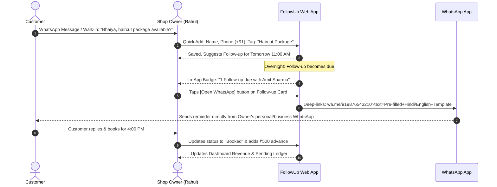
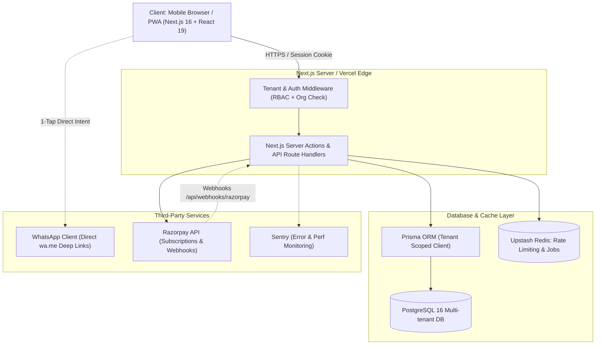
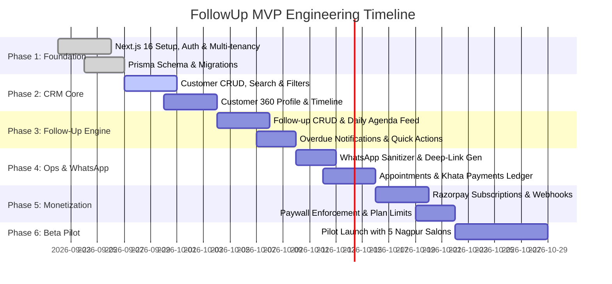

# Product Requirements Document (PRD) & Technical Architecture Spec
## FollowUp — WhatsApp Mini-CRM for Local Service Businesses

**Document Version:** 1.0.0-PROD-MVP  
**Status:** Approved for Implementation  
**Target Market:** Indian Local Service Businesses (Tier 1 to Tier 3)  
**Launch Niche:** Salons, Barbers, Repair Technicians, Tutors, Tailors, Clinics  
**Tech Stack:** Next.js 16 (App Router), React 19, TypeScript, Tailwind CSS v4, PostgreSQL, Prisma ORM, Redis / BullMQ, Razorpay  
**Currency:** INR (₹)  
**Primary Communication Channel:** WhatsApp (Native Deep Links & Web App Links)

---

## 1. Executive Summary & Product Vision

### 1.1 Problem Statement
India's 60+ million micro and small service businesses run their entire customer operations on fragmented tools:
* WhatsApp chats for enquiries, booking, and reminders.
* Paper diaries, pocket notebooks, or raw memory for customer records.
* Disorganized UPI screenshots and loose scraps for pending payments (Khata/Udhar).
* Lost follow-ups: 40–60% of potential repeat business is lost simply because the owner forgets to follow up 2–4 weeks later.
* Enterprise CRMs (Salesforce, HubSpot, Zoho) are bloated, desktop-centric, cost-prohibitive, and overwhelmingly complex for a local salon or repair shop owner.

### 1.2 Product Vision
**FollowUp** is the **"WhatsApp + Digital Pocket Notebook" CRM**. It empowers non-tech-savvy local business owners to capture leads, track appointments, schedule follow-ups, and collect pending payments in under 3 taps—triggering pre-filled WhatsApp conversations with zero friction and zero initial Meta API setup costs.

```
       ┌────────────────────────────────────────────────────────┐
       │                   FollowUp Vision                      │
       │  "As simple as WhatsApp, as organized as a notebook"  │
       └────────────────────────────────────────────────────────┘
                                    │
          ┌─────────────────────────┼─────────────────────────┐
          ▼                         ▼                         ▼
   [ Fast Data Entry ]       [ Zero-API WhatsApp ]      [ Payment Tracking ]
   Tap-and-save records       1-Click pre-filled chat    Track Khata / Udhar
   Mobile-optimized UI        No Meta API hurdles        Instant UPI reminders
```

---

## 2. Target Personas & User Journeys

### 2.1 Personas

| Attribute | Primary Persona: Shop Owner (Rahul) | Secondary Persona: Employee / Staff (Amit) |
| :--- | :--- | :--- |
| **Profile** | Rahul, 32. Runs "Rahul Men's Salon" in Nagpur. 2 staff members. | Amit, 24. Senior hair stylist at Rahul's salon. |
| **Tech Literacy** | High familiarity with WhatsApp, YouTube, PhonePe/GooglePay. Dislikes complex desktop software. | Uses smartphone for personal WhatsApp and Instagram. |
| **Current Tool** | Paper diary at the cash register + WhatsApp chat list. | Asks Rahul who is booked next; receives customer notes verbally. |
| **Pain Points** | • Forgets clients who promised to visit next weekend.<br>• Unpaid balances forgotten unless manually scrolled in WhatsApp.<br>• Staff don't have customer preference notes (e.g. hair dye brand). | • Doesn't know the day's schedule ahead of time.<br>• Awkwardness following up on pending customer balances. |
| **Value Sought** | Daily 2-minute morning scan: "Who do I need to message or call today?" | Simple daily task list: "Who are my appointments today?" |

### 2.2 Core User Journey (The "Golden Loop")


```mermaid
sequenceDiagram
    autonumber
    actor Customer
    actor Owner as Shop Owner (Rahul)
    participant CRM as FollowUp Web App
    participant WA as WhatsApp App

    Customer->>Owner: WhatsApp Message / Walk-in: "Bhaiya, haircut package available?"
    Owner->>CRM: Quick Add: Name, Phone (+91), Tag: "Haircut Package"
    CRM-->>Owner: Saved. Suggests Follow-up for Tomorrow 11:00 AM
    Note over CRM: Overnight: Follow-up becomes due
    CRM-->>Owner: In-App Badge: "1 Follow-up due with Amit Sharma"
    Owner->>CRM: Taps [Open WhatsApp] button on Follow-up Card
    CRM->>WA: Deep-links: wa.me/919876543210?text=Pre-filled+Hindi/English+Template
    WA-->>Customer: Sends reminder directly from Owner's personal/business WhatsApp
    Customer->>Owner: Customer replies & books for 4:00 PM
    Owner->>CRM: Updates status to "Booked" & adds ₹500 advance
    CRM-->>Owner: Updates Dashboard Revenue & Pending Ledger
```

---

## 3. Product Scope & Non-Goals

### 3.1 In-Scope for MVP (v1.0)
1. **Multi-Tenant Foundation:** Strict database-level isolation per business (`organization_id`).
2. **Fast Onboarding:** 3-step setup in < 180 seconds.
3. **Customer Directory:** Mobile-first list, fast search, tag filtering, CSV bulk import/export.
4. **Customer 360 Profile:** Complete chronological activity log, total lifetime value, balance pending.
5. **Follow-Up Engine:** Date/time scheduler, priority tiers, status progression, daily agenda view.
6. **Appointment Tracker:** Daily/weekly view, service type, time slot, assigned staff member.
7. **Pending Payment & Khata Ledger:** Total billed, amount received, pending balance, payment modes (UPI, Cash, Card).
8. **WhatsApp Action Engine:** Pre-filled template generation, phone number normalization (+91 India E.164), 1-tap `wa.me` deep linking.
9. **Message Template Manager:** Customizable templates with variables (`{{customer_name}}`, `{{business_name}}`, `{{amount}}`, `{{date}}`, etc.).
10. **Role-Based Access Control (RBAC):** Owner (full control & billing), Admin, Employee (restricted to assigned operations).
11. **In-App Notification Bar & Daily Task Digest.**
12. **Monetization Engine:** Razorpay subscription checkout for Starter (₹299/mo) and Business (₹699/mo).

### 3.2 Explicit Non-Goals (Out of Scope for v1.0)
* ❌ **Official WhatsApp Business Cloud API:** No webhook servers, message templates approval, or per-conversation Meta fees in MVP.
* ❌ **Full Double-Entry Accounting / GST Filing:** Only lightweight cash & pending balance tracking.
* ❌ **Inventory & Stock Management:** No SKU tracking or barcode scanning.
* ❌ **Native Android / iOS Binaries:** Web-first responsive PWA optimized for Chrome/Safari on mobile.
* ❌ **AI Conversational Bots:** Human-driven messages; no autonomous bot replying.
* ❌ **Multi-Currency / Multi-Country Localization:** India-exclusive (+91 phone numbers and INR ₹ currency).

---

## 4. Functional Specifications & UX Wireframes

### 4.1 Authentication & Multi-Tenant Onboarding
* **Sign Up / Login:** Email & Password (with Bcrypt hashing) + Session cookie. (Google Auth & Phone OTP ready in v1.1).
* **Onboarding Wizard (3 Minutes max):**
  1. *Business Identity:* Business Name (e.g. "Apex Auto Garage"), Business Category (Dropdown: Salon, Barbershop, Repair Shop, Tuition/Coach, Tailor, Clinic, Other), City (e.g. Nagpur, Pune, Jaipur).
  2. *Initial Customer Population:* Option to [Upload CSV] or [Add 1 Customer Manually] or [Use Sample Demo Data].
  3. *Immediate Activation Hook:* "Create your first follow-up reminder for tomorrow."

### 4.2 Executive Dashboard (`/dashboard`)
* **KPI Metrics Bar:**
  * `Active Customers` (Total count + delta this month).
  * `Follow-ups Today` (Pending count / Overdue highlight in Amber/Red).
  * `Appointments Today` (Count scheduled).
  * `Pending Khata (₹)` (Total uncollected revenue in INR).
* **Today's Action Feed (Chronological):**
  ```text
  ┌────────────────────────────────────────────────────────────────────────┐
  │ 🔔 TODAY'S FOLLOW-UPS (3 DUE)                                          │
  ├────────────────────────────────────────────────────────────────────────┤
  │ [10:30 AM]  Rahul Verma  •  Hair Spa Follow-up                         │
  │ Note: Asked to confirm if weekend slot is required.                    │
  │ [💬 WhatsApp]   [📞 Call]   [✓ Mark Done]   [↷ Reschedule]             │
  ├────────────────────────────────────────────────────────────────────────┤
  │ [02:00 PM]  Dr. Anjali Patil  •  Pending Payment (₹1,200)             │
  │ Note: Tailoring balance pending since 3 days.                          │
  │ [💬 Send Payment Reminder]  [₹ Record Cash]  [✓ Settled]               │
  └────────────────────────────────────────────────────────────────────────┘
  ```
* **Recent Customers Table:** Last contacted date, status pill, pending balance, quick actions.

### 4.3 Customer Management & Customer 360 Profile (`/customers/:id`)
* **List View:**
  * Quick search bar (name, phone number, note text).
  * Filter pills: `All`, `Active`, `Follow-up Due`, `Pending Payment`, `Completed`.
  * Bulk Actions: CSV Import (with validation preview) and CSV Export.
* **Customer 360 View:**
  ```text
  ┌────────────────────────────────────────────────────────────────────────┐
  │ ← Back to Customers                                                    │
  │                                                                        │
  │ RAHUL SHARMA                             [ STATUS: ACTIVE ]            │
  │ 📞 +91 98230 12345 (Nagpur)              Total Spent: ₹4,500           │
  │ 🏷️ VIP Client, Regular Haircut           Pending Due: ₹500 (⚠️ Khata)  │
  ├────────────────────────────────────────────────────────────────────────┤
  │ QUICK ACTIONS:                                                         │
  │ [💬 Open WhatsApp] [📞 Call] [+ Follow-up] [+ Appointment] [+ Payment] │
  ├────────────────────────────────────────────────────────────────────────┤
  │ TIMELINE & HISTORY                                                     │
  │ • 21 Sep 2026, 04:30 PM — Payment of ₹1,000 received (UPI). ₹500 due. │
  │ • 21 Sep 2026, 03:30 PM — Appointment completed: "Keratin Treatment"   │
  │ • 19 Sep 2026, 11:00 AM — WhatsApp reminder sent via FollowUp         │
  │ • 15 Sep 2026, 02:00 PM — Customer added to CRM                       │
  └────────────────────────────────────────────────────────────────────────┘
  ```

### 4.4 Follow-Up Management (`/followups`)
* **Core Data Fields:** `customer_id`, `title`, `scheduled_at`, `priority` (`LOW`, `MEDIUM`, `HIGH`), `status` (`PENDING`, `COMPLETED`, `CANCELLED`), `notes`.
* **State Machine:**
  ```mermaid
  stateDiagram-v2
      [*] --> PENDING: Created with Date & Time
      PENDING --> COMPLETED: Owner clicks [Mark Done]
      PENDING --> RESCHEDULED: Owner changes Date/Time
      PENDING --> CANCELLED: Dismissed / Irrelevant
      RESCHEDULED --> PENDING: Updates Schedule
      COMPLETED --> [*]
      CANCELLED --> [*]
  ```
* **Overdue Trigger:** Any follow-up where `scheduled_at < NOW()` and `status == 'PENDING'` receives high-visibility warning badge.

### 4.5 Appointments & Services (`/appointments`)
* **Fields:** `customer_id`, `service_name`, `start_time`, `end_time`, `assigned_to` (Staff Member ID), `notes`, `status` (`SCHEDULED`, `CONFIRMED`, `COMPLETED`, `CANCELLED`, `NO_SHOW`).
* **Views:**
  1. *Compact Agenda List* (Default for mobile phone screen).
  2. *7-Day Calendar Strip* (Allows quick day jumping).

### 4.6 Payment & Khata Ledger (`/payments`)
* **Data Fields:** `customer_id`, `reference_id` (e.g. Bill #104), `total_amount`, `paid_amount`, `pending_amount` (calculated: `total - paid`), `payment_method` (`UPI`, `CASH`, `CARD`, `OTHER`), `status` (`PAID`, `PARTIALLY_PAID`, `PENDING`, `REFUNDED`).
* **UPI Deep-Link / Payment Reminder Generation:**
  * Auto-generates a WhatsApp message containing the business's UPI ID (VPA) and the pending balance amount.

### 4.7 WhatsApp Deep-Link & Message Template Engine
* **Normalization Logic:**
  * Indian mobile inputs can vary (`9823012345`, `09823012345`, `+91 98230 12345`, `91-9823012345`).
  * System regex parses and cleans input to strict 12-digit format: `91XXXXXXXXXX`.
* **Deep Link Formats:**
  * Mobile Browser: `whatsapp://send?phone=91XXXXXXXXXX&text=URL_ENCODED_MESSAGE` (with fallback to `https://wa.me/91XXXXXXXXXX?text=URL_ENCODED_MESSAGE`).
  * Desktop Browser: `https://web.whatsapp.com/send?phone=91XXXXXXXXXX&text=URL_ENCODED_MESSAGE`.
* **Default Template Catalog:**
  1. *Appointment Reminder:*
     ```text
     Namaste {{customer_name}}! Reminder from {{business_name}}: Your appointment for {{service_name}} is booked for {{appointment_date}} at {{appointment_time}}. Please reach 5 minutes early. See you!
     ```
  2. *Payment / Khata Follow-up:*
     ```text
     Hello {{customer_name}}, this is a friendly reminder from {{business_name}}. You have a pending balance of ₹{{pending_amount}} for your recent visit. Kindly clear it via UPI to {{business_upi}}. Thank you!
     ```
  3. *Re-engagement / Service Due:*
     ```text
     Hi {{customer_name}}, it has been a month since your last visit at {{business_name}}. Would you like to schedule your next session this week? Reply here to book your slot!
     ```

---

## 5. Technical Architecture & Data Model

### 5.1 System Architecture


```mermaid
graph TD
    Client["Client: Mobile Browser / PWA (Next.js 16 + React 19)"]
    
    subgraph Edge_Vercel["Next.js Server / Vercel Edge"]
        Middleware["Tenant & Auth Middleware (RBAC + Org Check)"]
        ServerActions["Next.js Server Actions & API Route Handlers"]
    end

    subgraph Data_Layer["Database & Cache Layer"]
        Prisma["Prisma ORM (Tenant Scoped Client)"]
        Postgres[(PostgreSQL 16 Multi-tenant DB)]
        Redis[(Upstash Redis: Rate Limiting & Jobs)]
    end

    subgraph External_Services["Third-Party Services"]
        WA["WhatsApp Client (Direct wa.me Deep Links)"]
        Razorpay["Razorpay API (Subscriptions & Webhooks)"]
        Sentry["Sentry (Error & Perf Monitoring)"]
    end

    Client -->|HTTPS / Session Cookie| Middleware
    Middleware --> ServerActions
    ServerActions --> Prisma
    Prisma --> Postgres
    ServerActions --> Redis
    ServerActions --> Razorpay
    Client -.->|1-Tap Direct Intent| WA
    Razorpay -.->|Webhooks /api/webhooks/razorpay| ServerActions
    ServerActions -.-> Sentry
```

### 5.2 Multi-Tenant Data Schema (`schema.prisma`)

```prisma
datasource db {
  provider = "postgresql"
  url      = env("DATABASE_URL")
}

generator client {
  provider = "prisma-client-js"
}

enum Role {
  OWNER
  ADMIN
  EMPLOYEE
}

enum Priority {
  LOW
  MEDIUM
  HIGH
}

enum FollowUpStatus {
  PENDING
  COMPLETED
  CANCELLED
  RESCHEDULED
}

enum AppointmentStatus {
  SCHEDULED
  CONFIRMED
  COMPLETED
  CANCELLED
  NO_SHOW
}

enum PaymentStatus {
  PENDING
  PARTIALLY_PAID
  PAID
  REFUNDED
}

enum PaymentMethod {
  UPI
  CASH
  CARD
  BANK_TRANSFER
  OTHER
}

enum SubscriptionTier {
  FREE
  STARTER
  BUSINESS
  PRO
}

enum SubscriptionStatus {
  ACTIVE
  TRIALING
  PAST_DUE
  CANCELLED
}

// -------------------------------------------------------------
// 1. TENANT & USER MODELS
// -------------------------------------------------------------

model Organization {
  id              String             @id @default(cuid())
  name            String
  slug            String             @unique
  category        String             // e.g. "Salon", "Repair", "Tutor"
  city            String
  phone           String?
  upiId           String?            // e.g. rahul@okhdfcbank
  logoUrl         String?
  createdAt       DateTime           @default(now())
  updatedAt       DateTime           @updatedAt

  members         OrganizationMember[]
  customers       Customer[]
  followups       FollowUp[]
  appointments    Appointment[]
  payments        Payment[]
  templates       MessageTemplate[]
  subscriptions   Subscription[]
  notifications   Notification[]

  @@index([slug])
}

model User {
  id              String             @id @default(cuid())
  email           String             @unique
  passwordHash    String
  fullName        String
  phone           String?
  createdAt       DateTime           @default(now())
  updatedAt       DateTime           @updatedAt

  memberships     OrganizationMember[]
  assignedAppointments Appointment[] @relation("AssignedStaff")
}

model OrganizationMember {
  id              String             @id @default(cuid())
  organizationId  String
  userId          String
  role            Role               @default(EMPLOYEE)
  createdAt       DateTime           @default(now())

  organization    Organization       @relation(fields: [organizationId], references: [id], onDelete: Cascade)
  user            User               @relation(fields: [userId], references: [id], onDelete: Cascade)

  @@unique([organizationId, userId])
  @@index([organizationId])
}

// -------------------------------------------------------------
// 2. CRM CORE: CUSTOMERS & INTERACTIONS
// -------------------------------------------------------------

model Customer {
  id              String             @id @default(cuid())
  organizationId  String
  name            String
  phone           String             // Normalized: 91XXXXXXXXXX
  email           String?
  status          String             @default("Active") // Active, Booked, Inactive, Lost
  totalSpent      Decimal            @default(0.00) @db.Decimal(10, 2)
  pendingBalance  Decimal            @default(0.00) @db.Decimal(10, 2)
  tags            String[]           @default([])
  createdAt       DateTime           @default(now())
  updatedAt       DateTime           @updatedAt

  organization    Organization       @relation(fields: [organizationId], references: [id], onDelete: Cascade)
  notes           CustomerNote[]
  interactions    CustomerInteraction[]
  followups       FollowUp[]
  appointments    Appointment[]
  payments        Payment[]

  @@index([organizationId, phone])
  @@index([organizationId, name])
  @@index([organizationId, status])
}

model CustomerNote {
  id              String             @id @default(cuid())
  customerId      String
  authorName      String
  content         String             @db.Text
  createdAt       DateTime           @default(now())

  customer        Customer           @relation(fields: [customerId], references: [id], onDelete: Cascade)

  @@index([customerId])
}

model CustomerInteraction {
  id              String             @id @default(cuid())
  customerId      String
  type            String             // "WHATSAPP_SENT", "CALL_MADE", "NOTE_ADDED", "VISITED"
  summary         String
  metadata        Json?
  createdAt       DateTime           @default(now())

  customer        Customer           @relation(fields: [customerId], references: [id], onDelete: Cascade)

  @@index([customerId, createdAt])
}

// -------------------------------------------------------------
// 3. FOLLOW-UPS, APPOINTMENTS, & PAYMENTS
// -------------------------------------------------------------

model FollowUp {
  id              String             @id @default(cuid())
  organizationId  String
  customerId      String
  title           String
  notes           String?            @db.Text
  scheduledAt     DateTime
  priority        Priority           @default(MEDIUM)
  status          FollowUpStatus     @default(PENDING)
  completedAt     DateTime?
  createdAt       DateTime           @default(now())
  updatedAt       DateTime           @updatedAt

  organization    Organization       @relation(fields: [organizationId], references: [id], onDelete: Cascade)
  customer        Customer           @relation(fields: [customerId], references: [id], onDelete: Cascade)

  @@index([organizationId, scheduledAt, status])
  @@index([customerId])
}

model Appointment {
  id              String             @id @default(cuid())
  organizationId  String
  customerId      String
  assignedStaffId String?
  serviceName     String
  startTime       DateTime
  endTime         DateTime
  price           Decimal?           @db.Decimal(10, 2)
  status          AppointmentStatus  @default(SCHEDULED)
  notes           String?            @db.Text
  createdAt       DateTime           @default(now())
  updatedAt       DateTime           @updatedAt

  organization    Organization       @relation(fields: [organizationId], references: [id], onDelete: Cascade)
  customer        Customer           @relation(fields: [customerId], references: [id], onDelete: Cascade)
  assignedStaff   User?              @relation("AssignedStaff", fields: [assignedStaffId], references: [id])

  @@index([organizationId, startTime, status])
  @@index([customerId])
}

model Payment {
  id              String             @id @default(cuid())
  organizationId  String
  customerId      String
  billNumber      String?
  totalAmount     Decimal            @db.Decimal(10, 2)
  paidAmount      Decimal            @db.Decimal(10, 2)
  pendingAmount   Decimal            @db.Decimal(10, 2)
  method          PaymentMethod      @default(UPI)
  status          PaymentStatus      @default(PENDING)
  notes           String?
  createdAt       DateTime           @default(now())
  updatedAt       DateTime           @updatedAt

  organization    Organization       @relation(fields: [organizationId], references: [id], onDelete: Cascade)
  customer        Customer           @relation(fields: [customerId], references: [id], onDelete: Cascade)

  @@index([organizationId, status])
  @@index([customerId])
}

// -------------------------------------------------------------
// 4. TEMPLATES, BILLING & NOTIFICATIONS
// -------------------------------------------------------------

model MessageTemplate {
  id              String             @id @default(cuid())
  organizationId  String
  title           String             // e.g. "Appointment 1h Reminder"
  category        String             // "APPOINTMENT", "PAYMENT", "MARKETING"
  body            String             @db.Text
  isDefault       Boolean            @default(false)
  createdAt       DateTime           @default(now())
  updatedAt       DateTime           @updatedAt

  organization    Organization       @relation(fields: [organizationId], references: [id], onDelete: Cascade)

  @@index([organizationId, category])
}

model Subscription {
  id              String             @id @default(cuid())
  organizationId  String
  tier            SubscriptionTier   @default(FREE)
  status          SubscriptionStatus @default(TRIALING)
  razorpaySubId   String?            @unique
  razorpayPlanId  String?
  currentPeriodEnd DateTime?
  createdAt       DateTime           @default(now())
  updatedAt       DateTime           @updatedAt

  organization    Organization       @relation(fields: [organizationId], references: [id], onDelete: Cascade)

  @@index([organizationId])
}

model Notification {
  id              String             @id @default(cuid())
  organizationId  String
  title           String
  message         String
  link            String?
  isRead          Boolean            @default(false)
  createdAt       DateTime           @default(now())

  organization    Organization       @relation(fields: [organizationId], references: [id], onDelete: Cascade)

  @@index([organizationId, isRead])
}
```

---

## 6. Core Logic Implementations

### 6.1 Indian Phone Number Sanitizer & WhatsApp URL Builder
In India, mobile numbers may be typed with spaces, dashes, leading `0`, or `+91`. The CRM must normalize this to RFC-compliant E.164 without symbols.

```typescript
// lib/whatsapp.ts
export function normalizeIndianPhoneNumber(input: string): string | null {
  // 1. Strip all non-digit characters
  const digits = input.replace(/\D/g, "");

  // 2. Handle 10-digit standard Indian format: 9823012345 -> 919823012345
  if (digits.length === 10 && /^[6-9]\d{9}$/.test(digits)) {
    return `91${digits}`;
  }

  // 3. Handle 11-digit leading zero format: 09823012345 -> 919823012345
  if (digits.length === 11 && digits.startsWith("0") && /^[6-9]\d{9}$/.test(digits.slice(1))) {
    return `91${digits.slice(1)}`;
  }

  // 4. Handle 12-digit with 91 prefix: 919823012345
  if (digits.length === 12 && digits.startsWith("91") && /^[6-9]\d{9}$/.test(digits.slice(2))) {
    return digits;
  }

  return null; // Invalid Indian mobile number
}

export function generateWhatsAppLink(phone: string, message: string): string {
  const normalizedPhone = normalizeIndianPhoneNumber(phone);
  if (!normalizedPhone) {
    throw new Error("Invalid phone number format for WhatsApp");
  }
  const encodedText = encodeURIComponent(message);
  return `https://wa.me/${normalizedPhone}?text=${encodedText}`;
}

export function interpolateTemplate(
  templateBody: string,
  variables: Record<string, string | number>
): string {
  return templateBody.replace(/{{\s*(\w+)\s*}}/g, (_, key) => {
    return variables[key] !== undefined ? String(variables[key]) : `{{${key}}}`;
  });
}
```

### 6.2 Multi-Tenant Database Scoping (Prisma Client Extension)
To make tenant isolation mathematically foolproof, all tenant-level queries pass through an organization context wrapper:

```typescript
// lib/prisma.ts
import { PrismaClient } from "@prisma/client";

export const prisma = new PrismaClient();

// Enforce organizationId on all queries via context
export function createTenantClient(organizationId: string) {
  return prisma.$extends({
    query: {
      customer: {
        async $allOperations({ operation, args, query }) {
          if (["findMany", "findFirst", "count", "aggregate"].includes(operation)) {
            (args as any).where = { ...(args as any).where, organizationId };
          }
          return query(args);
        },
      },
      followUp: {
        async $allOperations({ operation, args, query }) {
          if (["findMany", "findFirst", "count", "aggregate"].includes(operation)) {
            (args as any).where = { ...(args as any).where, organizationId };
          }
          return query(args);
        },
      },
    },
  });
}
```

---

## 7. REST & Server Actions API Contracts

### 7.1 Customer Endpoints
* `GET /api/customers?query=rahul&status=Active&page=1&limit=25`
  * Response: `{ data: Customer[], total: number, page: number, totalPages: number }`
* `POST /api/customers`
  * Body: `{ name: string, phone: string, email?: string, tags?: string[] }`
  * Returns: `201 Created` with created `Customer` object
* `GET /api/customers/:id`
  * Returns full 360 view with populated `followups`, `appointments`, `payments`, and `notes`.
* `POST /api/customers/import-csv`
  * Accepts `multipart/form-data` with CSV file.
  * Validates headers: `name, phone, status, notes`.
  * Returns summary: `{ importedCount: 45, skippedCount: 2, errors: [...] }`

### 7.2 Follow-Up Endpoints
* `GET /api/followups?date=today&status=PENDING`
* `POST /api/followups`
  * Body: `{ customerId: string, title: string, scheduledAt: string, priority: "LOW"|"MEDIUM"|"HIGH", notes?: string }`
* `PATCH /api/followups/:id/complete`
  * Sets `status = "COMPLETED"`, `completedAt = now()`.
  * Automatically creates an entry in `CustomerInteraction` timeline.

### 7.3 Payment & Khata Endpoints
* `POST /api/payments`
  * Body: `{ customerId: string, totalAmount: number, paidAmount: number, method: "UPI"|"CASH"|"CARD", notes?: string }`
  * Automatically calculates `pendingAmount = totalAmount - paidAmount`.
  * Atomically increments `Customer.totalSpent` and updates `Customer.pendingBalance`.

---

## 8. Subscription & Feature Limits Matrix

| Feature / Limit | Free Tier (₹0) | Starter (₹299 / mo) | Business (₹699 / mo) | Pro (₹1,499 / mo) |
| :--- | :--- | :--- | :--- | :--- |
| **Active Customers** | Max 50 | Max 500 | Unlimited | Unlimited |
| **Follow-up Reminders** | Unlimited | Unlimited | Unlimited | Unlimited |
| **Staff Members** | 1 (Owner only) | 1 (Owner only) | Up to 5 staff | Unlimited |
| **Appointments & Services** | ❌ (List only) | ✅ Full Scheduling | ✅ Full Scheduling | ✅ Multi-chair / Multi-room |
| **Payment & Khata Tracking**| Basic | ✅ Detailed Ledger | ✅ Detailed Ledger | ✅ Advanced Khata + Statements|
| **WhatsApp Templates** | 2 system templates | 10 custom templates | Unlimited custom | Dynamic AI Templates (v2) |
| **CSV Import & Export** | ❌ | ✅ | ✅ | ✅ |
| **Multi-Branch Support** | ❌ | ❌ | ❌ | ✅ Multiple locations |

---

## 9. Security, Isolation & Compliance

1. **Zero Data Leaks (Tenant Isolation):**
   * Every query requires an authenticated session with an explicit `organizationId`.
   * Server actions verify that the user's `OrganizationMember` record matches the target entity's `organizationId`.
2. **Indian Digital Personal Data Protection (DPDP) Compliance:**
   * Customer phone numbers are never exposed in public endpoints or query logs.
   * Simple 1-click customer data purge and export on demand.
3. **Rate Limiting:**
   * Powered by Upstash Redis: max 60 requests/min per IP on auth routes; max 300 requests/min on data routes.
4. **Input Sanitization:**
   * Strict Zod schema parsing on all Server Actions and Route Handlers to eliminate XSS, prototype pollution, and SQL injection.

---

## 10. Implementation Plan & 6-Week Sprint Breakdown


```mermaid
gantt
    title FollowUp MVP Engineering Timeline
    dateFormat  YYYY-MM-DD
    section Phase 1: Foundation
    Next.js 16 Setup, Auth & Multi-tenancy :done, 2026-09-22, 4d
    Prisma Schema & Migrations             :done, 2026-09-24, 3d
    section Phase 2: CRM Core
    Customer CRUD, Search & Filters        :active, 2026-09-27, 4d
    Customer 360 Profile & Timeline       :2026-09-30, 4d
    section Phase 3: Follow-Up Engine
    Follow-up CRUD & Daily Agenda Feed     :2026-10-04, 4d
    Overdue Notifications & Quick Actions  :2026-10-07, 3d
    section Phase 4: Ops & WhatsApp
    WhatsApp Sanitizer & Deep-Link Gen     :2026-10-10, 3d
    Appointments & Khata Payments Ledger   :2026-10-12, 4d
    section Phase 5: Monetization
    Razorpay Subscriptions & Webhooks      :2026-10-16, 4d
    Paywall Enforcement & Plan Limits      :2026-10-19, 3d
    section Phase 6: Beta Pilot
    Pilot Launch with 5 Nagpur Salons      :2026-10-22, 7d
```

### Sprint Detail
* **Week 1 (Foundation):** Set up project structure, Auth.js/session management, multi-tenant middleware, Shadcn UI primitives, database migrations.
* **Week 2 (CRM Core):** Customer table, mobile responsive search, CSV importer, Customer 360 profile with timeline.
* **Week 3 (Follow-ups):** Follow-up scheduler, Today's Tasks list on Dashboard, priority badges, completion modals.
* **Week 4 (Ops & WhatsApp Engine):** Appointments calendar, Payment record modal, WhatsApp variable substitution engine, 1-tap `wa.me` links.
* **Week 5 (Monetization & Razorpay):** Customer limit guardrails, Razorpay webhook handlers, upgrade banner, billing portal.
* **Week 6 (Hyper-Local Beta Pilot):** Field testing with 5–10 real barbers/salons in Nagpur; UX optimization based on real usage.

---

## 11. Hyper-Local Go-To-Market Playbook

### 11.1 The "Nagpur Pilot" Strategy
* **Direct Merchant Outreach:**
  * Visit 20 high-footfall salons in Dharampeth, Sadar, and Sitabuldi (Nagpur).
  * Give a 90-second on-phone demo: *"Bhaiya, customer ko WhatsApp bhejne mein kitna time lagta hai? Yeh dekho 1-click reminder."*
* **The "No-Risk" Offer:**
  * 14 days free full-featured access.
  * Developer personally helps format and import their contacts list from Google Contacts or Excel.
* **The First Milestone:**
  * 10 businesses using the tool for their daily follow-up routine.
  * 3 businesses paying ₹299/mo via Razorpay UPI Autopay.
